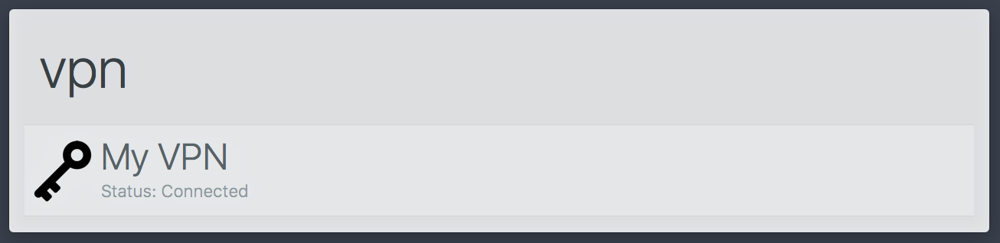

# alfred-vpn

> Alfred 3 workflow to connect/disconnect from VPNs



## Install

```
$ npm install --global alfred-vpn
```

*Requires [Node.js](https://nodejs.org) 4+ and the Alfred [Powerpack](https://www.alfredapp.com/powerpack/).*


## Usage

In Alfred, type `vpn`. Once loaded, you'll see a listing of configured VPN services. Select the VPN you'd like to connect/disconnect and press `Enter`. The workflow will attempt to connect/disconnect the selected service based on it's connectivity state.


## License

MIT (c) Steve Agalloco. See [LICENSE](https://github.com/stve/alfred-vpn/blob/master/LICENSE.md) for details.
